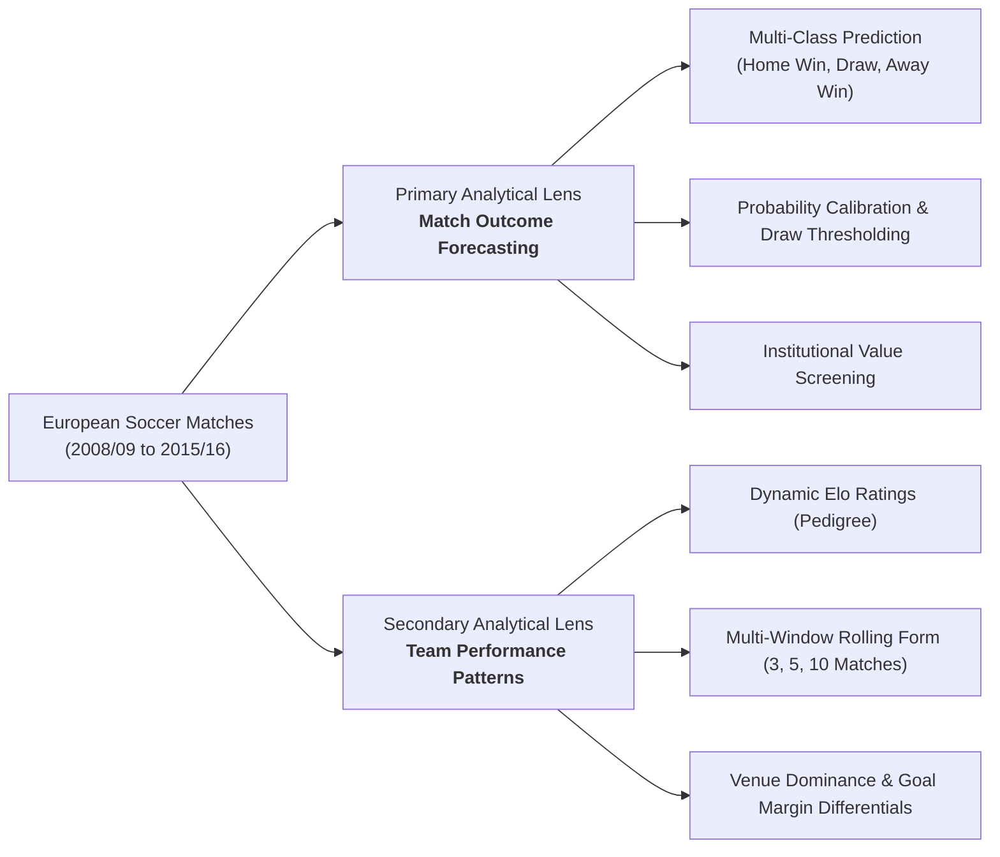

# ⚽︎ SoccerOutcome AI

[](https://www.python.org/)
[](https://streamlit.io/)
[](https://scikit-learn.org/)
[](https://xgboost.readthedocs.io/)
[]()

---

## 1. Project Overview & Business Problem

**SoccerOutcome AI** is an institutional-grade machine learning decision support system developed for the European soccer industry. Predicting association football match outcomes is notoriously challenging due to low-scoring event dynamics, high tactical stochasticity, and frequent stalemates (draws). 

This project formulates match forecasting as a **supervised multi-class classification** problem (`Home Win`, `Draw`, `Away Win`) evaluated on top European league competitions. Rather than relying on static post-match statistics or betting market prices, the pipeline synthesizes pre-match team pedigree, rolling momentum trajectories, venue-specific advantages, and dynamic Elo ratings to generate calibrated outcome probabilities.

---

## 2. Project Scope & Analytical Lenses

The predictive framework investigates match outcomes across two complementary analytical lenses:



### 2.1 Primary Lens: Match Outcome Classification
* Predicts the 3-way match result: **Home Win** (Class 2), **Draw** (Class 1), or **Away Win** (Class 0).
* Provides multi-class probability distributions with an empirical **calibrated draw threshold** ($\theta_{\text{draw}} \approx 0.360$) to address class imbalance and capture low-scoring stalemates.
* Compares 4 tuned machine learning model families: **Random Forest**, **Logistic Regression**, **Decision Tree**, and **XGBoost Classifier**.

### 2.2 Secondary Lens: Team Performance & Longitudinal Patterns
* **Long-Term Quality (Elo Ratings)**: Iterative Elo strength tracker accounting for opponent difficulty and victory margin.
* **Rolling Form Trajectories**: Multi-timescale rolling performance windows across 3-match (immediate surge), 5-match (short-term momentum), and 10-match (medium-term stability) horizons.
* **Venue Asymmetry**: Symmetrical differentials separating general scoring firepower from home pitch fortress resilience and away pitch fragility.

---

## 3. Target Definition & Anti-Leakage Protocols

Data leakage is the most critical failure mode in predictive sports modeling. SoccerOutcome AI enforces strict architectural guardrails to guarantee 100% pre-match integrity:

### 3.1 Target Variable Definition
The prediction target is derived strictly from full-time regular goals scored:
$$\text{Target} = \begin{cases} 
\text{Home Win (2)}, & \text{if } \text{home\_team\_goal} > \text{away\_team\_goal} \\
\text{Draw (1)}, & \text{if } \text{home\_team\_goal} = \text{away\_team\_goal} \\
\text{Away Win (0)}, & \text{if } \text{home\_team\_goal} < \text{away\_team\_goal} 
\end{cases}$$

### 3.2 Strict In-Match Event Isolation
* **Zero Post-Kickoff Leakage**: Post-match statistics (e.g., match shots, corners, fouls, cards, possession percentages, and in-game substitutions) are **strictly excluded** from feature inputs.
* **Pure Pre-Match Vector**: Only historical metrics compiled prior to the scheduled kickoff date are ingested into the feature pipeline.
* **Market Odds Decoupling**: Bookmaker decimal payouts (`B365H`, `B365D`, `B365A`) and implied odds are decoupled from model training, ensuring models learn genuine soccer mechanics rather than mirroring institutional betting margins.

### 3.3 Chronological Time-Based Data Splitting
Traditional random $K$-fold cross-validation causes catastrophic **temporal leakage** (using future match trends to predict past matches). We enforce a strict chronological partition across seasons:

```
+-------------------------------------------------------------------------------------------------+
|                                CHRONOLOGICAL TIME-BASED DATA SPLIT                               |
+--------------------------+-----------------------+--------------------+-------------------------+
| Partition Split          | Season Coverage       | Sample Count       | Purpose                 |
+--------------------------+-----------------------+--------------------+-------------------------+
| Training Set (Train)     | 2008/2009 – 2013/2014 | 18,179 Fixtures    | Model Training & Tuning |
| Validation Set (Val)     | 2014/2015             | 3,932 Fixtures     | Hyperparameter Tuning   |
| Holdout Test Set (Test)  | 2015/2016             | 3,923 Fixtures     | Final Unseen Evaluation |
+--------------------------+-----------------------+--------------------+-------------------------+
```

---

## 4. Dataset Source

The primary data source is the acclaimed **European Soccer Database** made publicly available on Kaggle:

* **Source Repository**: [Kaggle — European Soccer Database](https://www.kaggle.com/datasets/hugomathien/soccer) (by Hugo Mathien)
* **Format**: SQLite Database (`database.sqlite`, ~300 MB)
* **Scope**: Over 25,000 matches, 300+ clubs, and 10,000+ players across 11 European countries spanning seasons 2008/2009 to 2015/2016.
* **Competitions Included**: England Premier League, France Ligue 1, Germany 1. Bundesliga, Italy Serie A, Netherlands Eredivisie, Poland Ekstraklasa, Portugal Liga ZON Sagres, Scotland Premier League, Spain LIGA BBVA, and Switzerland Super League.

---

## 5. System Quick Start & Installation

### 5.1 Prerequisites
* Python `3.10`, `3.11`, or `3.12` installed.
* `git` installed.

### 5.2 Step-by-Step Setup

```bash
# 1. Clone the repository
git clone https://github.com/AruniAyodhya/Sports-Analytics.git
cd Sports-Analytics

# 2. Create and activate a Python virtual environment
python -m venv venv

# On Windows (PowerShell):
.\venv\Scripts\Activate.ps1
# On macOS/Linux:
source venv/bin/activate

# 3. Install required project dependencies
pip install -r requirements.txt

# 4. Launch the Streamlit Decision Support Application
streamlit run app.py
```

Once launched, access the interactive dashboard in your browser at `http://localhost:8501`.

---

## 6. Project Directory Structure

```text
Sports-Analytics/
├── .streamlit/         # Streamlit app configuration & theme settings
├── artifacts/          # Serialized models, fitted scalers & dataset splits
├── assets/             # Brand logos, favicons, and modular CSS stylesheets
├── docs/               # Technical documentation & feature dictionary
├── notebooks/          # Data preprocessing, training & comparison notebooks
├── src/                # Core inference engine & styling loader
├── views/              # Modular UI dashboards (Simulator, Evaluator, Comparison)
├── app.py              # Streamlit application entrypoint
├── requirements.txt    # Project dependencies
└── README.md           # Project documentation & execution guide
```

---

## 7. Model Performance & Comparative Benchmark

Across the 3,923 holdout test fixtures from season 2015/2016, our models demonstrate robust, balanced generalization across all 3 outcome classes (`Home Win`, `Draw`, `Away Win`), verified by our cross-model evaluation suite in [`notebooks/Model Comparison.ipynb`](notebooks/Model%20Comparison.ipynb) and saved in [`artifacts/final_comparison/final_model_comparison.csv`](artifacts/final_comparison/final_model_comparison.csv):

### 7.1 Holdout Test Benchmark (Season 2015/16 — 3,923 Matches)

| Model Architecture | Selected Features | Multi-Class Accuracy | Macro F1-Score | ROC-AUC (OVR) | Key Behavioral Characteristic |
| :--- | :---: | :---: | :---: | :---: | :--- |
| **XGBoost Classifier (Tuned)** | **50** | **45.91%** | **0.4338** | **0.6467** | **Tactical Nuance**: Top test accuracy (45.91%); models complex non-linear interactions and short-term momentum shifts. |
| **Decision Tree (Pruned RFE)** | **20** | **45.88%** | **0.4312** | **0.6393** | **Rule Boundaries**: Compact 20-feature tree with transparent splits anchored heavily on road loss rates. |
| **Logistic Regression (L1)** | **26** | **45.27%** | **0.4407** | **0.6526** | **Full Explainability**: Selected primary model (Val Macro F1 0.4603); highest test ROC-AUC (0.6526) and 47.34% uncalibrated argmax accuracy. |
| **Random Forest (Tuned)** | **34** | **45.07%** | **0.4409** | **0.6493** | **Consensus Anchor**: Top holdout Macro F1 (0.4409); balanced probability curves anchored by Elo (27.4%) and Goal Difference (23.2%). |

> [!NOTE]
> **Baseline Comparison**: In high-entropy 3-class football prediction (`Home Win` ~44%, `Draw` ~25%, `Away Win` ~31%), the **Naive Majority Class Baseline** (always predicting `Home Win`) achieves **44.21% accuracy** but yields a poor **Macro F1 of 0.2047** (zero recall for draws and away wins). All 4 trained pipelines significantly outperform the baseline, elevating Macro F1 to **0.431–0.441** and sustaining multi-class ROC-AUC between **0.639–0.653**.

### 7.2 Model Lifecycle Generalization Summary

| Model Family | Training Accuracy | Training Macro F1 | Validation Accuracy | Validation Macro F1 | Validation ROC-AUC | Test Accuracy | Test Macro F1 | Test ROC-AUC |
| :--- | :---: | :---: | :---: | :---: | :---: | :---: | :---: | :---: |
| **Logistic Regression** | 45.54% | 0.4471 | **47.07%** | **0.4603** | **0.6643** | 45.27% | 0.4407 | **0.6526** |
| **Random Forest** | 47.47% | 0.4644 | 46.53% | 0.4549 | 0.6634 | 45.07% | **0.4409** | 0.6493 |
| **Decision Tree** | 47.11% | 0.4567 | 46.76% | 0.4474 | 0.6510 | 45.88% | 0.4312 | 0.6393 |
| **XGBoost** | **50.80%** | **0.4931** | 46.37% | 0.4432 | 0.6611 | **45.91%** | 0.4338 | 0.6467 |

For complete feature relationship details, refer to:
* [Feature Inventory & Data Dictionary](docs/feature_inventory.md)
* [Feature Relationship Breakdown & Simulator Guide](docs/feature_relationship_breakdown.md)
* [Model Execution & Lifecycle Guide](docs/model-execution.md)
