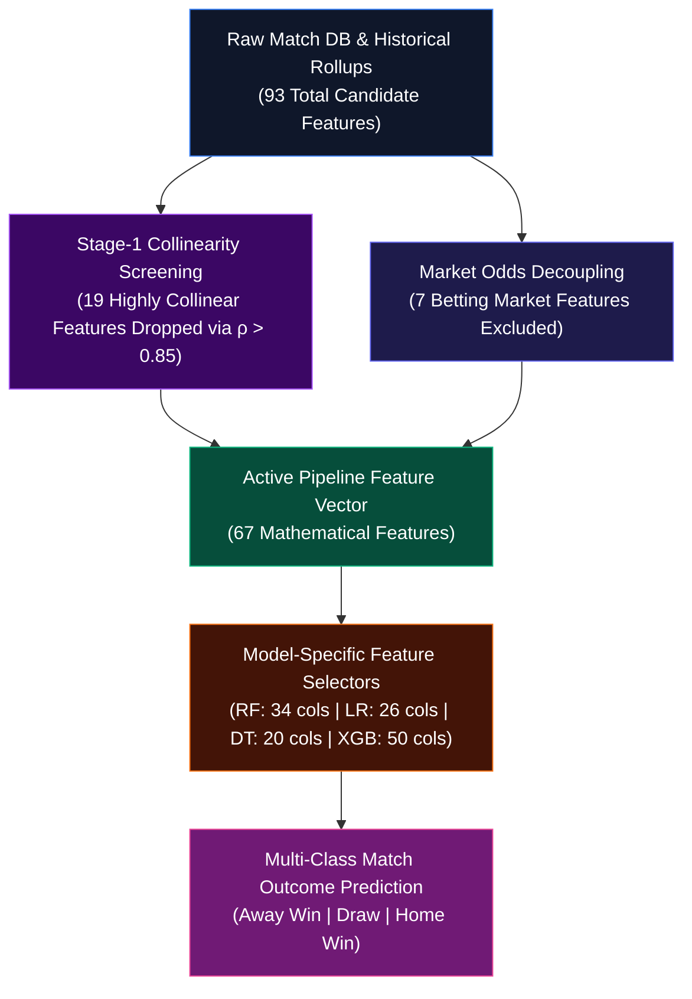

# Machine Learning Pipeline Feature Inventory & Data Dictionary

> **Documentation Type:** Production Pipeline Feature Inventory, Data Types & Technical Provenance Dictionary  

---

## 1. Architectural Overview & Feature Ingestion Pipeline

The machine learning inference engine ([src/inference.py](../src/inference.py)) processes European soccer match fixtures through a structured multi-stage feature lifecycle:



### Feature Ingestion Breakdown:
* **Raw Historical Dataset (93 Features)**: Contains pre-match performance ratios, venue splits, rolling momentum windows, days of rest, Elo ratings, betting odds, and domestic league one-hot indicators stored in [artifacts/final_dataset/X_train_tree.csv](../artifacts/final_dataset/X_train_tree.csv).
* **Decoupled Market Features (7 Features)**: Bookmaker decimal odds and implied probabilities are decoupled from model training to prevent data leakage ([src/inference.py:L463-L468](../src/inference.py#L463-L468)).
* **Stage-1 Correlation Pruning (19 Features Dropped)**: Features with pairwise collinearity $\rho > 0.85$ are removed using serialized drop masks (e.g., [artifacts/random_forest/correlation_dropped_columns.joblib](../artifacts/random_forest/correlation_dropped_columns.joblib)).
* **Active Model Vector (67 Features)**: The surviving 67 features enter the model pipelines and are dynamically synthesized during live simulations in [src/inference.py:L429-L613](../src/inference.py#L429-L613).

---

## 2. The Complete 67-Feature Pipeline Dictionary

The 67 active features are organized into six functional categories. Every feature is typed, mathematically defined, and mapped to its pipeline implementation:

### 2.1 Category 1: Elo Ratings & Long-Term Relative Strength (3 Features)
Elo ratings quantify long-term competitive pedigree updated iteratively following each competitive match, dynamically accounting for opponent strength and margin of victory.

| Feature Name | Data Type | Mathematical Definition & Description | Key Model Utilization | Engine Code Reference |
| :--- | :---: | :--- | :--- | :--- |
| `elo_difference` | `float64` | Net pre-match Elo rating difference ($\text{Elo}_{\text{Home}} - \text{Elo}_{\text{Away}}$). Clamped to $[-450.0, +450.0]$. | **#1 overall predictor across RF (27.4%), LR ($\beta = +0.193$), and XGB (13.8%)**. | [src/inference.py:L493-L501](../src/inference.py#L493-L501) |
| `home_elo_before` | `float64` | Absolute pre-match Elo rating of the Home team (scale: ~1100–1950). | Baseline quality anchor across tree models; provides league-wide calibration. | [src/inference.py:L502](../src/inference.py#L502) |
| `away_elo_before` | `float64` | Absolute pre-match Elo rating of the Away team (scale: ~1100–1950). | Evaluates underdog vs. powerhouse status for visiting clubs. | [src/inference.py:L503](../src/inference.py#L503) |

---

### 2.2 Category 2: Goal Scoring & Conceding Metrics (11 Features)
Captures season-long attacking firepower, defensive solidity, and venue-specific scoring tendencies.

| Feature Name | Data Type | Mathematical Definition & Description | Key Model Utilization | Engine Code Reference |
| :--- | :---: | :--- | :--- | :--- |
| `goals_for_difference` | `float64` | Season goals scored/match difference between Home and Away ($\text{GF}_{\text{Home}} - \text{GF}_{\text{Away}}$). | **#2 overall predictor in RF (23.2%), LR ($\beta = +0.147$), XGB (9.5%)**. | [src/inference.py:L506-L511](../src/inference.py#L506-L511) |
| `goals_against_difference` | `float64` | Season goals conceded/match difference ($\text{GA}_{\text{Home}} - \text{GA}_{\text{Away}}$). Exactly $-\text{goals\_for\_difference}$. | Defensive penalty factor in LR ($\beta = +0.071$ for Away Win). | [src/inference.py:L512](../src/inference.py#L512) |
| `venue_goals_for_difference` | `float64` | Season goals scored by Home team at home minus goals scored by Away team away ($\text{HGF}_{\text{Home}} - \text{AGF}_{\text{Away}}$). | **Dominant in Decision Tree (22.9% Gini) and Random Forest (8.9%)**. | [src/inference.py:L513](../src/inference.py#L513) |
| `venue_goals_against_difference` | `float64` | Home goals conceded at home minus Away goals conceded away ($\text{HGA}_{\text{Home}} - \text{AGA}_{\text{Away}}$). | Measures home fortress resilience versus road defensive vulnerability. | [src/inference.py:L514](../src/inference.py#L514) |
| `home_goals_for_per_match` | `float64` | Season average goals scored per match by the host club (clipped to $[0.15, 3.5]$). | Host attacking volume anchor across all tree architectures. | [src/inference.py:L517](../src/inference.py#L517) |
| `home_goals_against_per_match` | `float64` | Season average goals conceded per match by the host club (clipped to $[0.15, 3.5]$). | Host defensive vulnerability indicator. | [src/inference.py:L519](../src/inference.py#L519) |
| `away_goals_for_per_match` | `float64` | Season average goals scored per match by the visiting club (clipped to $[0.15, 3.5]$). | Evaluates away team counter-attacking threat. | [src/inference.py:L518](../src/inference.py#L518) |
| `away_goals_against_per_match` | `float64` | Season average goals conceded per match by the visiting club (clipped to $[0.15, 3.5]$). | Evaluates visitor backline fragility on the road. | [src/inference.py:L520](../src/inference.py#L520) |
| `home_home_goals_against_per_match` | `float64` | Season average goals conceded by host team strictly on home soil. | Selected in Decision Tree and Random Forest for home clean sheet propensity. | [src/inference.py:L524](../src/inference.py#L524) |
| `away_away_goals_for_per_match` | `float64` | Season average goals scored by visiting team strictly on away grounds. | Retained in Logistic Regression ($\beta_{\text{Away}} = +0.043$). | [src/inference.py:L522](../src/inference.py#L522) |
| `away_away_goals_against_per_match` | `float64` | Season average goals conceded by visiting team strictly on away grounds. | Visitor road fragility split feature in XGBoost. | [src/inference.py:L523](../src/inference.py#L523) |

---

### 2.3 Category 3: Rolling Form & Momentum Windows (27 Features)
Models multi-timescale competitive form across 10-match (medium-term), 5-match (short-term), and 3-match (immediate surge) rolling windows for points and goals.

#### 10-Match Rolling Form (Medium-Term Trajectory — 9 Features)
| Feature Name | Data Type | Mathematical Definition & Description | Pipeline Role & Model Impact | Engine Code Reference |
| :--- | :---: | :--- | :--- | :--- |
| `points_last10_difference` | `float64` | Net points earned across the last 10 fixtures ($\text{Home} - \text{Away}$). Clamped to $[-2.8, +2.8]$. | Primary medium-term league form trajectory metric. | [src/inference.py:L561-L562](../src/inference.py#L561-L562) |
| `home_points_last10` | `float64` | Average points earned per match by Home team in last 10 fixtures (clipped to $[0.1, 2.9]$). | Stable baseline form anchor for the home side. | [src/inference.py:L563](../src/inference.py#L563) |
| `away_points_last10` | `float64` | Average points earned per match by Away team in last 10 fixtures (clipped to $[0.1, 2.9]$). | Stable baseline form anchor for the away side. | [src/inference.py:L564](../src/inference.py#L564) |
| `goals_for_last10_difference` | `float64` | Net goals scored per match across last 10 fixtures ($\text{Home} - \text{Away}$). | Selected in LR ($\beta = +0.041$), RF, and XGBoost. | [src/inference.py:L527](../src/inference.py#L527) |
| `goals_against_last10_difference` | `float64` | Net goals conceded per match across last 10 fixtures ($\text{Home} - \text{Away}$). | Key medium-term defensive metric in LR ($\beta = -0.040$). | [src/inference.py:L528](../src/inference.py#L528) |
| `home_goals_for_last10` | `float64` | Goals scored per match by host in last 10 fixtures. | Host scoring volume stability. | [src/inference.py:L529](../src/inference.py#L529) |
| `home_goals_against_last10` | `float64` | Goals conceded per match by host in last 10 fixtures. | Host defensive stability. | [src/inference.py:L530](../src/inference.py#L530) |
| `away_goals_for_last10` | `float64` | Goals scored per match by visitor in last 10 fixtures. | Visitor scoring volume stability. | [src/inference.py:L531](../src/inference.py#L531) |
| `away_goals_against_last10` | `float64` | Goals conceded per match by visitor in last 10 fixtures. | Visitor concession rate stability. | [src/inference.py:L532](../src/inference.py#L532) |

#### 5-Match Rolling Form (Short-Term Momentum — 9 Features)
| Feature Name | Data Type | Mathematical Definition & Description | Pipeline Role & Model Impact | Engine Code Reference |
| :--- | :---: | :--- | :--- | :--- |
| `points_last5_difference` | `float64` | Net points earned per match over last 5 matches ($\text{Home} - \text{Away}$). Clamped to $[-3.0, +3.0]$. | Directly driven by UI **Recent 5-Match Form** slider. | [src/inference.py:L567-L568](../src/inference.py#L567-L568) |
| `home_points_last5` | `float64` | Points earned per match by host team over last 5 fixtures. | High-gain split feature in XGBoost (1.80% Gain). | [src/inference.py:L570](../src/inference.py#L570) |
| `away_points_last5` | `float64` | Points earned per match by visitor team over last 5 fixtures. | Road momentum indicator in XGBoost. | [src/inference.py:L571](../src/inference.py#L571) |
| `goals_for_last5_difference` | `float64` | Net goals scored per match over last 5 fixtures ($\text{Home} - \text{Away}$). | Immediate attacking form surge differential. | [src/inference.py:L577](../src/inference.py#L577) |
| `goals_against_last5_difference`| `float64` | Net goals conceded per match over last 5 fixtures ($\text{Home} - \text{Away}$). | Primary defensive penalty in LR ($\beta = -0.0401$). | [src/inference.py:L576](../src/inference.py#L576) |
| `home_goals_for_last5` | `float64` | Average goals scored per match by host in last 5 fixtures. | Short-term attacking surge for host. | [src/inference.py:L581](../src/inference.py#L581) |
| `home_goals_against_last5` | `float64` | Average goals conceded per match by host in last 5 fixtures. | Short-term backline leakiness for host. | [src/inference.py:L582](../src/inference.py#L582) |
| `away_goals_for_last5` | `float64` | Average goals scored per match by visitor in last 5 fixtures. | Short-term attacking surge for visitor. | [src/inference.py:L583](../src/inference.py#L583) |
| `away_goals_against_last5` | `float64` | Average goals conceded per match by visitor in last 5 fixtures. | Short-term backline leakiness for visitor. | [src/inference.py:L584](../src/inference.py#L584) |

#### 3-Match Rolling Form (Immediate Surge Dynamics — 9 Features)
| Feature Name | Data Type | Mathematical Definition & Description | Pipeline Role & Model Impact | Engine Code Reference |
| :--- | :---: | :--- | :--- | :--- |
| `points_last3_difference` | `float64` | Net points earned per match over last 3 fixtures ($\text{Home} - \text{Away}$). | High-volatility streak indicator. | [src/inference.py:L569](../src/inference.py#L569) |
| `home_points_last3` | `float64` | Points earned per match by host in preceding 3 fixtures. | Retained in Logistic Regression and XGBoost. | [src/inference.py:L572](../src/inference.py#L572) |
| `away_points_last3` | `float64` | Points earned per match by visitor in preceding 3 fixtures. | Retained in Logistic Regression and XGBoost. | [src/inference.py:L573](../src/inference.py#L573) |
| `goals_for_last3_difference` | `float64` | Net goals scored per match over last 3 matches ($\text{Home} - \text{Away}$). | Immediate goal burst indicator. | [src/inference.py:L580](../src/inference.py#L580) |
| `goals_against_last3_difference`| `float64` | Net goals conceded per match over last 3 matches ($\text{Home} - \text{Away}$). | Immediate defensive slump indicator. | [src/inference.py:L578-L579](../src/inference.py#L578-L579) |
| `home_goals_for_last3` | `float64` | Goals scored per match by host in last 3 fixtures. | High-frequency host scoring spike. | [src/inference.py:L586](../src/inference.py#L586) |
| `home_goals_against_last3` | `float64` | Goals conceded per match by host in last 3 fixtures. | High-frequency host defensive concession. | [src/inference.py:L587](../src/inference.py#L587) |
| `away_goals_for_last3` | `float64` | Goals scored per match by visitor in last 3 fixtures. | High-frequency visitor scoring spike. | [src/inference.py:L588](../src/inference.py#L588) |
| `away_goals_against_last3` | `float64` | Goals conceded per match by visitor in last 3 fixtures. | High-frequency visitor defensive concession. | [src/inference.py:L589](../src/inference.py#L589) |

---

### 2.4 Category 4: Match Outcome Rates & Conversion Frequencies (13 Features)
Converts historical match results into empirical win, draw, and loss probabilities across all venues and conditioned on home/away grounds.

| Feature Name | Data Type | Mathematical Definition & Description | Key Model Utilization | Engine Code Reference |
| :--- | :---: | :--- | :--- | :--- |
| `win_rate_difference` | `float64` | Overall win rate of Home team minus Away team ($\text{WR}_{\text{Home}} - \text{WR}_{\text{Away}}$). Clamped to $[-0.9, +0.9]$. | **#3 overall predictor in RF (12.8%) and XGB (6.4%)**. | [src/inference.py:L535-L540](../src/inference.py#L535-L540) |
| `draw_rate_difference` | `float64` | Difference in season draw rates ($\text{DR}_{\text{Home}} - \text{DR}_{\text{Away}}$). | Critical baseline input for calibrated draw thresholding ($\theta \approx 0.360$). | [src/inference.py:L542](../src/inference.py#L542) |
| `venue_win_rate_difference` | `float64` | Home win rate at home minus Away win rate away ($\text{HWR}_{\text{Home}} - \text{AWR}_{\text{Away}}$). | **#3 predictor in Decision Tree (15.0% Gini)**. | [src/inference.py:L541](../src/inference.py#L541) |
| `home_win_rate` | `float64` | Total wins divided by total matches played by Home team ($[0.05, 0.90]$). | Core reliability metric in RF and XGBoost. | [src/inference.py:L544, L549](../src/inference.py#L544) |
| `away_win_rate` | `float64` | Total wins divided by total matches played by Away team ($[0.05, 0.90]$). | Core reliability metric in RF and XGBoost. | [src/inference.py:L545, L550](../src/inference.py#L545) |
| `home_draw_rate` | `float64` | Total draws divided by total matches played by Home team. | Stalemating propensity metric for host. | [src/inference.py:L546, L551](../src/inference.py#L546) |
| `away_draw_rate` | `float64` | Total draws divided by total matches played by Away team. | Stalemating propensity metric for visitor. | [src/inference.py:L547, L552](../src/inference.py#L547) |
| `home_loss_rate` | `float64` | Total losses divided by matches played ($1.0 - \text{WR}_{\text{Home}} - \text{DR}_{\text{Home}}$). | Host collapse probability metric. | [src/inference.py:L553](../src/inference.py#L553) |
| `away_loss_rate` | `float64` | Total losses divided by matches played ($1.0 - \text{WR}_{\text{Away}} - \text{DR}_{\text{Away}}$). | **#1 decision boundary in Decision Tree (34.2% Gini)**. | [src/inference.py:L554](../src/inference.py#L554) |
| `home_home_win_rate` | `float64` | Host win rate strictly on home soil ($[0.05, 0.95]$). | Quantifies genuine home pitch advantage. | [src/inference.py:L555](../src/inference.py#L555) |
| `home_home_draw_rate` | `float64` | Host draw rate strictly on home soil. | Retained in Logistic Regression and Decision Tree. | [src/inference.py:L556](../src/inference.py#L556) |
| `away_away_win_rate` | `float64` | Visiting team win rate strictly on away grounds ($[0.05, 0.95]$). | Road resilience metric in LR ($\beta = +0.031$). | [src/inference.py:L557](../src/inference.py#L557) |
| `away_away_draw_rate` | `float64` | Visiting team draw rate strictly on away grounds. | Road stalemating metric in Random Forest. | [src/inference.py:L558](../src/inference.py#L558) |

---

### 2.5 Category 5: Match Context, Calendar & Rest Dynamics (3 Features)
Accounts for tournament maturity, season stage variance, and player fatigue.

| Feature Name | Data Type | Mathematical Definition & Description | Key Model Utilization | Engine Code Reference |
| :--- | :---: | :--- | :--- | :--- |
| `stage` | `float64` / `int` | Matchweek of the domestic league season (range: 1 to 38). | Models seasonal stabilization; scales differentials via `stage_factor`. | [src/inference.py:L452-L461](../src/inference.py#L452-L461) |
| `home_days_since_last_match` | `float64` | Calendar days elapsed since host team's prior competitive match. | Fatigue and recovery indicator in Logistic Regression. | [src/inference.py:L454-L455](../src/inference.py#L454-L455) |
| `rest_days_difference` | `float64` | Rest days differential between Home and Away ($\text{Rest}_{\text{Home}} - \text{Rest}_{\text{Away}}$). | Fixture congestion asymmetry metric. | [src/inference.py:L457](../src/inference.py#L457) |

---

### 2.6 Category 6: Domestic League One-Hot Indicators (10 Features)
Binary categorical indicator columns ($0.0$ or $1.0$) capturing tactical tempos, typical goal-scoring environments, and historical draw base rates across 10 top European leagues.

| Feature Column Name | Data Type | Clean League Name | League Characteristics & Pipeline Role | Engine Code Reference |
| :--- | :---: | :--- | :--- | :--- |
| `league_name_England Premier League` | `float64` | England Premier League | High pace, physical intensity, balanced draw rate (~25.5%). | [src/inference.py:L64, L447-L449](../src/inference.py#L64) |
| `league_name_France Ligue 1` | `float64` | France Ligue 1 | Tactical, defensive structure; retained in Logistic Regression. | [src/inference.py:L65, L447-L449](../src/inference.py#L65) |
| `league_name_Germany 1. Bundesliga` | `float64` | Germany 1. Bundesliga | High attacking tempo; highest average goals per game (~3.15). | [src/inference.py:L66, L447-L449](../src/inference.py#L66) |
| `league_name_Italy Serie A` | `float64` | Italy Serie A | Tactical discipline, elevated draw frequency (~28.2%). | [src/inference.py:L67, L447-L449](../src/inference.py#L67) |
| `league_name_Netherlands Eredivisie` | `float64` | Netherlands Eredivisie | Open, attacking play with elevated offensive variance. | [src/inference.py:L68, L447-L449](../src/inference.py#L68) |
| `league_name_Poland Ekstraklasa` | `float64` | Poland Ekstraklasa | Moderate goal scoring, high home-ground advantage. | [src/inference.py:L69, L447-L449](../src/inference.py#L69) |
| `league_name_Portugal Liga ZON Sagres` | `float64` | Portugal Liga ZON Sagres | Pronounced quality polarization between top 3 clubs and rest. | [src/inference.py:L70, L447-L449](../src/inference.py#L70) |
| `league_name_Scotland Premier League` | `float64` | Scotland Premier League | Pronounced duopoly dynamics; retained in Logistic Regression. | [src/inference.py:L71, L447-L449](../src/inference.py#L71) |
| `league_name_Spain LIGA BBVA` | `float64` | Spain LIGA BBVA | Possession dominance, elevated home win frequency (~48.9%). | [src/inference.py:L72, L447-L449](../src/inference.py#L72) |
| `league_name_Switzerland Super League` | `float64` | Switzerland Super League | High-scoring league with elevated road victory variance. | [src/inference.py:L73, L447-L449](../src/inference.py#L73) |

---

## 3. Stage-1 Collinear Pruned Features (19 Features)

During offline exploratory data analysis and feature correlation screening, **19 candidate features** exhibited severe pairwise collinearity ($\rho > 0.85$–$0.94$). They are pruned prior to model training to prevent multicollinearity and variance inflation:

| # | Pruned Feature Name | Primary Collinear Partner ($\rho > 0.85$) | Mathematical Rationale for Elimination | UI Dynamic Propagation Surrogate |
| :-: | :--- | :--- | :--- | :--- |
| 1 | `points_per_match_difference` | `points_last10_difference` / `elo_difference` | Direct linear combination of season points; fully mirrored by rolling points and Elo. | Propagates $+70.0 \times \text{PPM}_{\text{diff}}$ into Elo and $+0.9 \times \text{PPM}_{\text{diff}}$ into `points_last10_difference`. |
| 2 | `home_points_per_match` | `home_win_rate` / `home_draw_rate` | Deterministic mathematical function: $\text{PPM} = 3 \times \text{WR} + 1 \times \text{DR}$. | Modulates `home_win_rate` and `home_points_last10`. |
| 3 | `away_points_per_match` | `away_win_rate` / `away_draw_rate` | Deterministic mathematical function: $\text{PPM} = 3 \times \text{WR} + 1 \times \text{DR}$. | Modulates `away_win_rate` and `away_points_last10`. |
| 4 | `home_goal_difference_per_match` | `goals_for_difference` | Symmetrically redundant against composite net goal differential. | Propagates directly into `goals_for_difference`. |
| 5 | `away_goal_difference_per_match` | `goals_against_difference` | Symmetrically redundant against composite net goal differential. | Propagates directly into `goals_against_difference`. |
| 6 | `home_home_points_per_match` | `home_home_win_rate` | Direct venue win/draw rate linear combination. | Mirrored by `home_home_win_rate`. |
| 7 | `away_away_points_per_match` | `away_away_win_rate` | Direct venue win/draw rate linear combination. | Mirrored by `away_away_win_rate`. |
| 8 | `home_home_goals_for_per_match` | `home_goals_for_per_match` | Redundant with overall season host scoring and venue differentials. | Mirrored by `venue_goals_for_difference`. |
| 9 | `venue_points_difference` | `points_per_match_difference` | Redundant with `venue_win_rate_difference`. | Mirrored by `venue_win_rate_difference`. |
| 10 | `home_win_rate_last3` | `home_points_last3` | Collinear with short-term 3-match points haul ($\rho > 0.92$). | Preserved via `home_points_last3`. |
| 11 | `home_win_rate_last5` | `home_points_last5` | Collinear with 5-match points haul ($\rho > 0.91$). | Preserved via `home_points_last5`. |
| 12 | `home_win_rate_last10` | `home_points_last10` | Collinear with 10-match points haul ($\rho > 0.89$). | Preserved via `home_points_last10`. |
| 13 | `away_win_rate_last3` | `away_points_last3` | Collinear with short-term 3-match points haul ($\rho > 0.92$). | Preserved via `away_points_last3`. |
| 14 | `away_win_rate_last5` | `away_points_last5` | Collinear with 5-match points haul ($\rho > 0.91$). | Preserved via `away_points_last5`. |
| 15 | `away_win_rate_last10` | `away_points_last10` | Collinear with 10-match points haul ($\rho > 0.89$). | Preserved via `away_points_last10`. |
| 16 | `win_rate_last3_difference` | `points_last3_difference` | Collinear with 3-match points differential ($\rho > 0.93$). | Preserved via `points_last3_difference`. |
| 17 | `win_rate_last5_difference` | `points_last5_difference` | Collinear with 5-match points differential ($\rho > 0.92$). | Preserved via `points_last5_difference`. |
| 18 | `win_rate_last10_difference` | `points_last10_difference` | Collinear with 10-match points differential ($\rho > 0.90$). | Preserved via `points_last10_difference`. |
| 19 | `away_days_since_last_match` | `rest_days_difference` | Redundant against `home_days_since_last_match` and rest delta. | Preserved via `rest_days_difference`. |

> [!NOTE]
> **Artifact & Engine Reference:** Pruned column lists are loaded via `load_dropped_columns()` in [src/inference.py:L178-L204](../src/inference.py#L178-L204) from [artifacts/random_forest/correlation_dropped_columns.joblib](../artifacts/random_forest/correlation_dropped_columns.joblib) and filtered dynamically at [src/inference.py:L602-L604](../src/inference.py#L602-L604).

---

## 4. Decoupled Market Consensus Odds (7 Features)

The raw database contains 7 betting market columns derived from bookmaker consensus odds:
* `market_home_probability`, `market_draw_probability`, `market_away_probability`
* `market_home_probability_std`, `market_draw_probability_std`, `market_away_probability_std`
* `market_missing`

### Anti-Leakage Protocol & Decoupling Rationale
1. **Strict Machine Learning Integrity**: Betting market odds reflect collective public wagering and bookmaker hedging margins, which already encapsulate team performance. Training ML models on odds causes models to simply reproduce market prices rather than learning genuine soccer principles.
2. **Decoupled Architecture in Simulator**: In [views/simulator.py:L116-L169](../views/simulator.py#L116-L169), decimal odds (`B365H`, `B365D`, `B365A`) are provided strictly for user convenience to calculate bookmaker overround and normalized market probabilities. In [src/inference.py:L463-L468](../src/inference.py#L463-L468), betting odds are **strictly excluded** from the inference vector, ensuring 100% authentic AI forecasts.

---

## 5. Target Variable Specification & Multi-Class Encoding

The supervised prediction target is the final full-time match outcome:

| Outcome Class | Target Integer ID | Label Name | Historical Training Frequency (Seasons 2008/09–2014/15) |
| :---: | :---: | :---: | :---: |
| Class 0 | `0` | **Away Win** | ~28.4% |
| Class 1 | `1` | **Draw** | ~25.6% |
| Class 2 | `2` | **Home Win** | ~46.0% |

* **Label Encoder Binary**: Fitted using scikit-learn `LabelEncoder` and persisted at [artifacts/final_dataset/target_encoder.joblib](../artifacts/final_dataset/target_encoder.joblib). Loaded via [src/inference.py:L150-L161](../src/inference.py#L150-L161) and inverted back to human-readable strings at [src/inference.py:L639](../src/inference.py#L639).
* **Calibrated Draw Thresholding**: Soccer draws are notoriously difficult to predict due to low event rates. The pipeline applies a calibrated optimal threshold ($\theta_{\text{draw}} \approx 0.360$) in [src/inference.py:L411-L424](../src/inference.py#L411-L424) loaded from [artifacts/random_forest/calibrated_draw_threshold.joblib](../artifacts/random_forest/calibrated_draw_threshold.joblib).

---

## 6. Model Feature Selection & Active Subset Summary

Each machine learning architecture uses a tailored feature selection algorithm to extract its optimal subset from the 67 pipeline features:

```
+-------------------------------------------------------------------------------------------------+
|                               MODEL-SPECIFIC FEATURE SUBSETS                                     |
+---------------------+------------------------------+--------------------+-----------------------+
| Model Architecture  | Feature Selection Technique  | Active Features    | Primary Anchors       |
+---------------------+------------------------------+--------------------+-----------------------+
| Random Forest       | SelectFromModel (Tree Gini)  | 34 Selected Cols   | Elo (27%), GD (23%)   |
| Logistic Regression | L1 Lasso Regularization      | 26 Selected Cols   | Elo Log-Odds (+0.193) |
| Decision Tree       | Recursive Feature Elimination| 20 Selected Cols   | Away Loss Rate (34.2%)|
| XGBoost Classifier  | Gain-Based Importance Split  | 50 Selected Cols   | Elo (13.8%), GD (9.5%)|
+---------------------+------------------------------+--------------------+-----------------------+
```

---

## 7. Artifact Storage & Code Reference Index

All datasets, serialized models, scalers, and drop sets are organized in structured repository directories:

| Asset Name | Repository File Path | Engine Loader / Script Reference | Description |
| :--- | :--- | :--- | :--- |
| **Dataset Splits Directory** | [artifacts/final_dataset/](../artifacts/final_dataset/) | [src/inference.py:L269-L388](../src/inference.py#L269-L388) | Contains all historical training, validation, and holdout test CSVs. |
| **Target Encoder** | [artifacts/final_dataset/target_encoder.joblib](../artifacts/final_dataset/target_encoder.joblib) | [src/inference.py:L150-L161](../src/inference.py#L150-L161) | Serialized multi-class label encoder (`Away Win`, `Draw`, `Home Win`). |
| **StandardScaler Scaler** | [artifacts/final_dataset/logistic_scaler.joblib](../artifacts/final_dataset/logistic_scaler.joblib) | [src/inference.py:L163-L176, L390-L409](../src/inference.py#L163-L176) | Fitted `StandardScaler` for Logistic Regression numerical normalization. |
| **Baseline Feature Split** | [artifacts/final_dataset/X_train_tree.csv](../artifacts/final_dataset/X_train_tree.csv) | [src/inference.py:L300-L338](../src/inference.py#L300-L338) | 93-column training distribution used to compute empirical league medians. |
| **Holdout Test Splits** | [artifacts/final_dataset/X_test_tree.csv](../artifacts/final_dataset/X_test_tree.csv)<br>[artifacts/final_dataset/y_test.csv](../artifacts/final_dataset/y_test.csv) | [src/inference.py:L339-L388](../src/inference.py#L339-L388) | 3,923 holdout test fixtures from season 2015/16 for evaluator validation. |
| **Random Forest Directory** | [artifacts/random_forest/](../artifacts/random_forest/) | [src/inference.py:L228-L263](../src/inference.py#L228-L263) | Tuned pipeline (`random_forest_tuned_pipeline.joblib`), drops, and thresholds. |
| **Logistic Regression Directory** | [artifacts/logistic_regression/](../artifacts/logistic_regression/) | [src/inference.py:L228-L263](../src/inference.py#L228-L263) | Tuned pipeline (`logistic_regression_tuned_pipeline.joblib`), drops, and thresholds. |
| **Decision Tree Directory** | [artifacts/decision_tree/](../artifacts/decision_tree/) | [src/inference.py:L228-L263](../src/inference.py#L228-L263) | Tuned pipeline (`decision_tree_tuned_pipeline.joblib`), drops, and thresholds. |
| **XGBoost Directory** | [artifacts/xgboost/](../artifacts/xgboost/) | [src/inference.py:L228-L263](../src/inference.py#L228-L263) | Tuned pipeline (`xgboost_tuned_pipeline.joblib`), drops, and thresholds. |
| **Simulator UI Implementation** | [views/simulator.py](../views/simulator.py) | [views/simulator.py:L73-L184](../views/simulator.py#L73-L184) | Pre-match interactive sliders and scenario dispatch to inference engine. |
| **Inference Engine Synthesis** | [src/inference.py](../src/inference.py) | [src/inference.py:L429-L645](../src/inference.py#L429-L645) | Feature synthesis, collinear dropping, scaling, and outcome classification. |