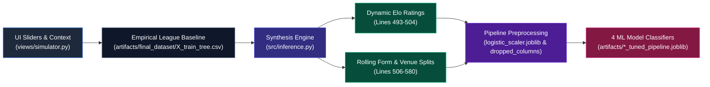

# UI Pre-Match Simulator & Model Behavior Guide

> **Guide Focus:** UI Simulator Controls, Feature Synthesis, and Machine Learning Model Decision Dynamics  

---

## 1. Overview of the UI Pre-Match Simulator

The **Pre-Match Simulator** in [views/simulator.py](../views/simulator.py) allows analysts, scouts, and football fans to test hypothetical **what-if** match scenarios in real time. Rather than forcing users to manually enter dozens of complex statistical parameters, the interface provides **4 intuitive relative performance sliders**, league and matchweek context selectors, and real-world market odds inputs.

### 1.1 The 4 Core Differential Sliders

Each slider captures the relative strength gap between the **Home Team** and the **Away Team** on a symmetric scale, where **positive values favour the host** and **negative values favour the visitor**:

| Slider Name & Widget Label | UI Range & Description | Mapped Core Pipeline Features |
| :--- | :--- | :--- |
| **Points/Match Difference**<br>`Points/Match Difference (Home - Away)`<br>*(UI: [views/simulator.py:L73-L80](../views/simulator.py#L73-L80))* | **Range**: `-3.0` to `+3.0` *(Step: 0.1)*<br><br>**Season-Long Quality Gap**: Measures the overall difference in points earned per game across the season. Higher positive values reflect a host with consistent league superiority. | • [`elo_difference`](../src/inference.py#L497) *(Synthesized Elo delta)*<br>• [`points_last10_difference`](../src/inference.py#L561-L562) *(Rolling 10-match points)*<br>• [`home_points_last10`](../src/inference.py#L563) / [`away_points_last10`](../src/inference.py#L564)<br>*(Baseline source: [artifacts/final_dataset/X_train_tree.csv](../artifacts/final_dataset/X_train_tree.csv))* |
| **Recent 5-Match Form**<br>`Recent 5-Match Points Difference`<br>*(UI: [views/simulator.py:L81-L88](../views/simulator.py#L81-L88))* | **Range**: `-3.0` to `+3.0` *(Step: 0.1)*<br><br>**Immediate Momentum**: Models current form trajectory across the last 5 competitive fixtures, enabling users to simulate hot winning streaks or cold spells. | • [`points_last5_difference`](../src/inference.py#L567-L568) *(Rolling 5-match points)*<br>• [`points_last3_difference`](../src/inference.py#L569) *(Rolling 3-match points)*<br>• [`goals_against_last5_difference`](../src/inference.py#L576) *(Defensive concession)*<br>• [`goals_for_last5_difference`](../src/inference.py#L577) *(Attacking form)* |
| **Goal Difference/Match**<br>`Goal Difference/Match (Home - Away)`<br>*(UI: [views/simulator.py:L89-L96](../views/simulator.py#L89-L96))* | **Range**: `-3.0` to `+3.0` *(Step: 0.1)*<br><br>**Offensive Firepower & Defensive Solidity**: Measures net scoring superiority per match ($\text{Goals Scored} - \text{Goals Conceded}$). Directly drives expected scoring volume. | • [`goals_for_difference`](../src/inference.py#L511) *(Net scoring margin)*<br>• [`goals_against_difference`](../src/inference.py#L512) *(Net defensive margin)*<br>• [`venue_goals_for_difference`](../src/inference.py#L513) *(Venue goal delta)*<br>• [`goals_for_last10_difference`](../src/inference.py#L527) *(10-match goal volume)* |
| **Recent Win Rate Difference**<br>`Recent Win Rate Difference`<br>*(UI: [views/simulator.py:L97-L104](../views/simulator.py#L97-L104))* | **Range**: `-1.0` to `+1.0` *(Step: 0.05)*<br><br>**Match-Winning Consistency**: Captures the percentage delta in recent matches won between the two sides. Higher values indicate higher host conversion rates. | • [`win_rate_difference`](../src/inference.py#L540) *(Win consistency delta)*<br>• [`venue_win_rate_difference`](../src/inference.py#L541) *(Venue win rate delta)*<br>• [`away_loss_rate`](../src/inference.py#L554) *(Visitor loss probability)*<br>• [`home_win_rate`](../src/inference.py#L549) / [`away_win_rate`](../src/inference.py#L550) |

### 1.2 Market Consensus Odds

The simulator also includes bookmaker decimal payout inputs (`B365H`, `B365D`, `B365A`) declared in [views/simulator.py:L116-L140](../views/simulator.py#L116-L140):
- **Role in the Interface**: These odds are automatically converted into **implied probabilities** and display the bookmaker's margin (**overround**) in [views/simulator.py:L141-L169](../views/simulator.py#L141-L169), giving users an institutional baseline.
- **Strict Anti-Leakage Protocol**: In our pipeline ([src/inference.py:L463-L468](../src/inference.py#L463-L468)), market odds are **strictly decoupled** from the machine learning inference engine. The models predict outcomes purely based on soccer performance metrics, ensuring an authentic AI forecast uncorrupted by betting market bias.

---

## 2. How Sliders Translate into Model Inputs (`src/inference.py`)

Under the hood, machine learning models cannot directly evaluate a raw 4-slider summary; they expect a calibrated feature vector matching the schema they were trained on. The dynamic synthesis engine in [src/inference.py:L429-L613](../src/inference.py#L429-L613) bridges this gap seamlessly:



### 2.1 The Synthesis Workflow

1. **Grounding in League Context (`get_league_baseline`)**:  
   When a user selects a league (e.g., *English Premier League* vs. *Italian Serie A*), the engine loads historical median baselines from [artifacts/final_dataset/X_train_tree.csv](../artifacts/final_dataset/X_train_tree.csv) via [src/inference.py:L300-L338](../src/inference.py#L300-L338). This anchors home advantage, league goal averages, and typical draw frequencies in the real dynamics of that competition.
2. **Dynamic Elo Rating Synthesis**:  
   Team Elo ratings reflect long-term competitive pedigree. The engine computes `elo_difference` ([src/inference.py:L493-L504](../src/inference.py#L493-L504)) by combining the league baseline with user slider inputs:
   $$\text{elo\_diff} \propto (\text{win\_rate\_diff} \times 250) + (\text{goals\_diff} \times 90) + (\text{ppm\_diff} \times 70) + \text{momentum}$$
   This ensures that entering a high positive goal difference and win rate correctly models a dominant team with an elevated Elo rating.
3. **Rolling Form & Venue Breakdown**:  
   The engine derives granular rolling metrics:
   - **Medium-term form**: `points_last10_difference` and `goals_for_last10_difference` ([src/inference.py:L527-L533, L561-L565](../src/inference.py#L527-L533)) are scaled from full-season PPM and goal differentials.
   - **Short-term momentum**: `points_last5_difference`, `points_last3_difference`, and defensive concessions (`goals_against_last5_difference`) respond directly to the Recent 5-Match Form slider ([src/inference.py:L567-L580](../src/inference.py#L567-L580)).
   - **Venue dynamics**: Applies empirical home-field adjustments so home scoring expectations are weighted realistically against away scoring strength ([src/inference.py:L513-L514, L541](../src/inference.py#L513-L514)).
4. **Pipeline Alignment & Preprocessing**:  
   Before running inference:
   - **Numerical Scaling**: Standardizes continuous variables for Logistic Regression via `StandardScaler` loaded from [artifacts/final_dataset/logistic_scaler.joblib](../artifacts/final_dataset/logistic_scaler.joblib) in [src/inference.py:L163-L176, L390-L409, L594-L600](../src/inference.py#L163-L176).
   - **Collinear Feature Dropping**: Filters out Stage-1 collinear columns using model-specific dropped column artifacts (e.g., [artifacts/random_forest/correlation_dropped_columns.joblib](../artifacts/random_forest/correlation_dropped_columns.joblib)) in [src/inference.py:L178-L204, L602-L604](../src/inference.py#L178-L204).
   - **Schema Enforcement**: Reindexes the synthesized DataFrame to guarantee exact column ordering matching `pipeline.feature_names_in_` in [src/inference.py:L606-L612](../src/inference.py#L606-L612).
5. **Real-Time UI Execution & Inference (`predict_simulation`)**:  
   When the user adjusts sliders in the simulator UI ([views/simulator.py:L73-L104](../views/simulator.py#L73-L104)), the application constructs the input scenario `sim_dict` ([views/simulator.py:L172-L182](../views/simulator.py#L172-L182)) and immediately triggers `engine.predict_simulation(sim_dict)` ([views/simulator.py:L184](../views/simulator.py#L184)). The engine synthesizes the 67-feature vector ([src/inference.py:L429-L613](../src/inference.py#L429-L613)), evaluates probabilities via `pipeline.predict_proba()` ([src/inference.py:L635](../src/inference.py#L635)), applies the calibrated draw threshold $\theta_{\text{draw}} \approx 0.360$ ([src/inference.py:L411-L424, L638](../src/inference.py#L411-L424)), and inverts target label IDs into readable text strings via [artifacts/final_dataset/target_encoder.joblib](../artifacts/final_dataset/target_encoder.joblib) ([src/inference.py:L150-L161, L639](../src/inference.py#L150-L161)).

---

### 2.2 Technical Feature Traceability & Origin Matrix

The table below provides full end-to-end traceability for developers and academic evaluators, documenting the exact data origin, UI declaration, and engine implementation for each synthesized feature:

| Core Pipeline Feature | Source / Origin Dataset | Implementation & Injection Code Reference | Pipeline Transformation & Role |
| :--- | :--- | :--- | :--- |
| `elo_difference`<br>`home_elo_before`<br>`away_elo_before` | **Historical Match DB + User Sliders**<br>Baseline Elo ratings calculated iteratively from match history; dynamically augmented at runtime by user sliders. | **UI Input:** [views/simulator.py:L73-L104](../views/simulator.py#L73-L104)<br>**Synthesis:** [src/inference.py:L493-L504](../src/inference.py#L493-L504)<br>**Baseline:** [artifacts/final_dataset/X_train_tree.csv](../artifacts/final_dataset/X_train_tree.csv) | Injected into Elo rating differential using $+250 \times \text{WR} + 90 \times \text{GD} + 70 \times \text{PPM} + \text{momentum}$, clamped between -450 and +450 around baseline. |
| `points_last10_difference`<br>`home_points_last10`<br>`away_points_last10` | **Rolling Window Calculation (10 Matches)**<br>Derived from historical 10-match rolling points hauls; modulated at runtime by full-season PPM and win rate sliders. | **UI Input:** [views/simulator.py:L73-L80](../views/simulator.py#L73-L80)<br>**Synthesis:** [src/inference.py:L561-L565](../src/inference.py#L561-L565)<br>**Baseline:** [artifacts/final_dataset/X_train_tree.csv](../artifacts/final_dataset/X_train_tree.csv) | Synthesized via $\text{clip}(0.9 \times \text{ppm} + 0.5 \times \text{eff\_wr}, -2.8, 2.8)$; symmetrically split into home and away points tallies. |
| `points_last5_difference`<br>`points_last3_difference` | **Rolling Window Calculation (3 & 5 Matches)**<br>Calculated from recent matchweek points trajectories; reflects immediate momentum entering kickoff. | **UI Input:** [views/simulator.py:L81-L88](../views/simulator.py#L81-L88)<br>**Synthesis:** [src/inference.py:L490, L567-L574](../src/inference.py#L490) | Extracts `recent_momentum` ($(\text{pts} - 0.8) \times 0.06$) and blends short-term form ($0.85 \times \text{recent} + 0.15 \times \text{ppm}$). |
| `goals_against_last5_difference`<br>`goals_for_last5_difference` | **Rolling Window Calculation (5 Matches)**<br>Calculated from 5-match conceded and scored goal tallies; tracks short-term defensive fragility. | **UI Input:** [views/simulator.py:L81-L88](../views/simulator.py#L81-L88)<br>**Synthesis:** [src/inference.py:L576-L580](../src/inference.py#L576-L580) | Evaluates short-term form: $\pm(0.4 \times \text{pts5\_diff} + 0.4 \times \text{eff\_goal\_diff})$; serves as a primary penalty feature in Logistic Regression. |
| `goals_for_difference`<br>`goals_against_difference`<br>`venue_goals_for_difference` | **Historical Season Match DB**<br>Aggregated season goals scored and conceded overall and split by home/away venue. | **UI Input:** [views/simulator.py:L89-L96](../views/simulator.py#L89-L96)<br>**Synthesis:** [src/inference.py:L506-L525](../src/inference.py#L506-L525)<br>**Baseline:** [artifacts/final_dataset/X_train_tree.csv](../artifacts/final_dataset/X_train_tree.csv) | Scales user goal differential by `league_pace` and `stage_factor` into `eff_goal_diff`; venue splits apply an empirical $0.85$ home-advantage multiplier. |
| `goals_for_last10_difference` | **Rolling Window Calculation (10 Matches)**<br>10-match historical goal scoring volumes. | **Synthesis:** [src/inference.py:L527-L533](../src/inference.py#L527-L533) | Scaled from `eff_goal_diff` $\times 0.95$ to represent medium-term goal volume. |
| `win_rate_difference`<br>`venue_win_rate_difference` | **Historical Season Match DB**<br>Season win percentages ($\text{Wins} / \text{Matches}$) overall and conditioned on venue. | **UI Input:** [views/simulator.py:L97-L104](../views/simulator.py#L97-L104)<br>**Synthesis:** [src/inference.py:L535-L542](../src/inference.py#L535-L542)<br>**Baseline:** [artifacts/final_dataset/X_train_tree.csv](../artifacts/final_dataset/X_train_tree.csv) | Modulated by `league_draw_factor` and season maturity into `eff_wr_diff`; venue win rate is scaled by $0.85$. |
| `away_loss_rate`<br>`home_loss_rate`<br>`home_win_rate` / `away_win_rate` | **Historical Match Outcome Rates**<br>Calculated empirical win, draw, and loss distributions per team. | **Synthesis:** [src/inference.py:L544-L559](../src/inference.py#L544-L559)<br>**Baseline:** [artifacts/final_dataset/X_train_tree.csv](../artifacts/final_dataset/X_train_tree.csv) | Dynamically derives probabilities: $\text{Loss Rate} = 1.0 - \text{Win Rate} - \text{Draw Rate}$; serves as the #1 decision boundary in Decision Tree. |
| `StandardScaler` Feature Scaling | **Training Set Distribution Artifact**<br>Fitted exclusively on training set rows ([artifacts/final_dataset/X_train_logistic.csv](../artifacts/final_dataset/X_train_logistic.csv)). | **Artifact:** [artifacts/final_dataset/logistic_scaler.joblib](../artifacts/final_dataset/logistic_scaler.joblib)<br>**Loader:** [src/inference.py:L163-L176](../src/inference.py#L163-L176)<br>**Transform:** [src/inference.py:L390-L409, L594-L600](../src/inference.py#L390-L409) | Normalizes continuous variables: $(x - \mu)/\sigma$ strictly for Logistic Regression to ensure valid coefficient optimization. |
| Stage-1 Correlation Pruning & Schema Alignment | **Correlation Screening Artifact**<br>Pruned features with pairwise $\rho > 0.85$. | **Artifact:** [artifacts/random_forest/correlation_dropped_columns.joblib](../artifacts/random_forest/correlation_dropped_columns.joblib)<br>**Loader:** [src/inference.py:L178-L204](../src/inference.py#L178-L204)<br>**Alignment:** [src/inference.py:L602-L612](../src/inference.py#L602-L612) | Strips 18 collinear features and enforces strict column ordering to match `pipeline.feature_names_in_` before invoking `predict_proba`. |

---

## 3. Model Behavior & Decision Style: How Each Model Reacts to the Sliders

Each of the 4 machine learning models has a distinct mathematical architecture, meaning they interpret and react to slider adjustments in fundamentally different ways.

```
+-----------------------------------------------------------------------------------------+
|                               MODEL DECISION STYLES AT A GLANCE                          |
+---------------------+-------------------------------+-----------------------------------+
| Model               | Primary Decision Anchor       | Behavioral Personality            |
+---------------------+-------------------------------+-----------------------------------+
| Random Forest       | Elo (27%) + Goal Diff (23%)   | Balanced, smooth, and robust      |
| Logistic Regression | Linear Elo & Goal Log-Odds    | Transparent, gradual push-and-pull|
| Decision Tree       | Away Team Loss Rate (34%)     | Step-like, sharp threshold splits |
| XGBoost             | Elo + Non-linear Form Windows | Nuanced, momentum-sensitive       |
+---------------------+-------------------------------+-----------------------------------+
```

---

### 3.1 Random Forest: The Balanced Ensemble Anchor

* **Decision Philosophy**: A collective ensemble of hundreds of decision trees, each trained on random feature subsets. It makes predictions by averaging votes across all trees.
* **Core Drivers**:
  * **`elo_difference` (27.4% importance)**: Overall long-term quality delta.
  * **`goals_for_difference` (23.2% importance)**: Net offensive scoring superiority.
  * **`win_rate_difference` (12.8% importance)**: Season-long winning consistency.
* **How It Reacts to the Sliders**:
  * **Smooth, Proportional Transitions**: Adjusting sliders produces gradual, realistic probability curves. Extreme spikes in a single slider will not throw off the entire prediction, because other trees in the ensemble anchor the match to long-term fundamentals.
  * **Respect for Quality & Firepower**: If you boost Goal Difference and Points/Match together, Random Forest rapidly gains confidence in a Home Win. It treats goal-scoring supremacy as the single most reliable sign of competitive dominance.

---

### 3.2 Logistic Regression: Transparent Push-and-Pull

* **Decision Philosophy**: A linear probabilistic model that sums weighted feature values into log-odds. Every feature has an explicit, interpretable direction and magnitude.
* **Core Drivers**:
  * **$\beta_{\text{Home Win}} = +0.1934$ for `elo_difference`**: Higher Elo directly increases home victory log-odds.
  * **$\beta_{\text{Home Win}} = +0.1471$ for `goals_for_difference`**: Greater goal superiority systematically boosts host success.
  * **$\beta_{\text{Home Win}} = -0.0401$ for `goals_against_last5_difference`**: Recent defensive leaks actively penalize the home side.
* **How It Reacts to the Sliders**:
  * **Direct Mathematical Proportionality**: There are no hidden jumps or unexpected bends. Moving the Goal Difference slider from `0.0` to `+1.0` adds a steady, predictable boost to home win probability while simultaneously driving away win probability down.
  * **Defensive Accountability**: Unlike tree models that might group defensive concession into broad buckets, Logistic Regression actively penalizes teams with poor recent form through its negative coefficient on recent goals conceded.

---

### 3.3 Decision Tree: Sharp Thresholds & Fragility Boundaries

* **Decision Philosophy**: A hierarchical flowchart of strict binary questions (`if feature > threshold then left else right`).
* **Core Drivers**:
  * **`away_loss_rate` (34.2% Gini importance)**: By far the single most influential split in the entire tree.
  * **`venue_goals_for_difference` (22.9% importance)**: Home scoring edge relative to visitor road output.
  * **`venue_win_rate_difference` (15.0% importance)**: Venue-specific winning delta.
* **How It Reacts to the Sliders**:
  * **Step-Like Tipping Points**: Rather than smooth curves, Decision Tree outcomes often change in abrupt jumps. As you move the Win Rate Difference or Goal Difference slider, probabilities remain identical until the slider crosses a precise split threshold (for example, whether the away team's calculated loss rate exceeds ~42%), at which point probabilities jump noticeably.
  * **Visitor Fragility Focus**: The tree's primary strategy is determining whether the visiting team is fragile on the road. If the sliders indicate poor visitor form, the model immediately commits to high Home Win probability.

---

### 3.4 XGBoost: Non-Linear Momentum & Nuance Specialist

* **Decision Philosophy**: Gradient boosted trees that build upon each other sequentially, correcting residuals from earlier trees and capturing high-order feature interactions.
* **Core Drivers**:
  * **`elo_difference` (13.8% Gain)**: Overall team pedigree anchor.
  * **`goals_for_difference` (9.5% Gain)**: Offensive creation advantage.
  * **Rolling Form Windows (>8.0% cumulative Gain)**: Granular splits across `home_points_last5`, `home_points_last3`, and short-term goal differentials.
* **How It Reacts to the Sliders**:
  * **Resolving Conflicting Signals**: In real football, a top club on a losing streak often struggles against a surging mid-table opponent. XGBoost excels at modeling this exact nuance: if you set Points/Match high (`+1.5`) but Recent 5-Match Form low (`-1.5`), XGBoost detects the clash between class and form, tempering home win confidence and elevating draw or upset probabilities.
  * **Context-Aware Sensitivity**: It dynamically adjusts the weight of goal differentials depending on match stage and league pace, offering the most tactically reactive prediction among all four models.

---

## 4. Key Takeaways for Evaluators

1. **Intuitive Controls, Complex Engine**: The 4 simulator sliders provide a simple, accessible interface, while [src/inference.py](../src/inference.py) handles the complex mathematical work of generating a complete, realistic 67-feature pre-match vector.
2. **Model Diversity**:
   - For **reliable, balanced forecasts**, **Random Forest** provides the safest consensus anchor.
   - For **full explainability**, **Logistic Regression** offers clear linear coefficients.
   - For **tactical fragility checks**, **Decision Tree** highlights key tipping points in visitor performance.
   - For **nuanced what-if testing** involving conflicting momentum and long-term form, **XGBoost** captures the most realistic interactions.
3. **Integrity & Realism**: By enforcing pre-match data boundaries and decoupling market odds, the simulator ensures all four models produce genuine, scientifically grounded machine learning forecasts.
