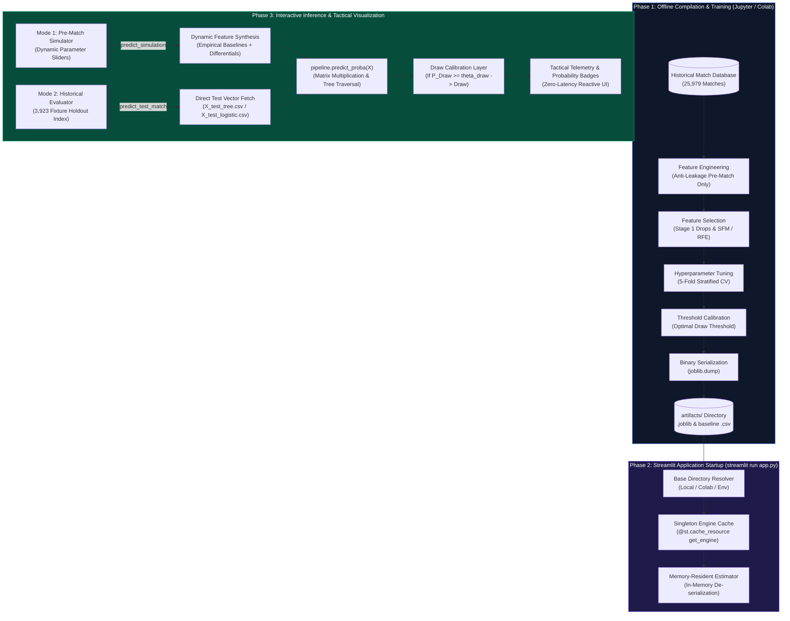
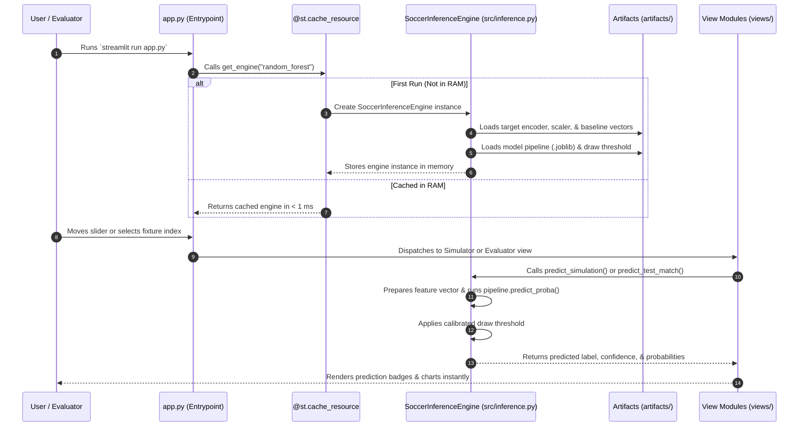

# Machine Learning Model Execution Architecture

> **Core Pipeline:** High-Dimensional 3-Class Outcome Forecasting (`Home Win`, `Draw`, `Away Win`)  
> **Artifact Type:** Technical Architecture & Model Runtime Documentation  

---

## 1. Title & Overview

This document details the software and machine learning engineering architecture governing **model lifecycle execution, artifact serialization, runtime deserialization, feature vector synthesis, and real-time inference** within the **SoccerOutcome AI** sports analytics decision support platform.

Unlike distributed enterprise platforms that introduce complex, multi-tiered microservice topologies for offline-trained models, this application integrates model execution directly into an **in-process, memory-resident Streamlit execution pipeline**. The trained estimators—spanning **Random Forest**, **L1-Regularized Logistic Regression**, **Decision Trees (RFE)**, and **Gradient-Boosted Trees (XGBoost)**—are pre-compiled into immutable binary artifacts (`.joblib`), loaded once into system RAM via singleton resource caching, and evaluated in microseconds upon user interaction.



---

## 2. Architectural Choice: Why Streamlit Over FastAPI / Flask?

Rather than deploying a separate backend API server (such as FastAPI or Flask) alongside a frontend, our system embeds the machine learning models directly inside the Streamlit runtime. This architectural choice provides several major benefits:

### 2.1 Key Engineering Advantages

1. **Zero Network Latency (< 5 ms execution)**  
   Because the models run directly in the same Python process in system RAM, predictions are evaluated through native C/NumPy matrix operations without HTTP roundtrips, socket overhead, or JSON serialization delays.

2. **Seamless State Synchronization with the UI**  
   Streamlit's reactive execution model automatically synchronizes input widgets (such as match sliders, bookmaker odds, and fixture indices) with the inference engine. The UI directly shares in-memory pandas DataFrames and scalers without needing duplicate validation models across two servers.

3. **Single-Command Startup & Evaluator Ease**  
   Evaluators and examiners only need to run a single command:
   ```bash
   streamlit run app.py
   ```
   There are no port conflicts, CORS issues, proxy configurations, or multiple terminal windows to manage.

4. **Lightweight Resource Usage (~150 MB RAM)**  
   All four trained models (Random Forest, Logistic Regression, Decision Tree, and XGBoost) together with test vectors take up roughly **150 MB of memory**, making a separate model server unnecessary.

### 2.2 Architecture Comparison

| Feature | Embedded In-Memory (Our Approach) | Separate API Service (FastAPI / Flask) |
| :--- | :--- | :--- |
| **Processes Required** | **1 single process** (`streamlit run app.py`) | 2+ processes (Streamlit + FastAPI + reverse proxy) |
| **Communication** | Direct in-memory function calls (`0 ms` network delay) | Local HTTP REST or WebSocket (`15–60 ms` latency) |
| **Deployment Complexity** | Single port, zero configuration | Requires multi-port management, CORS setup, and routing |
| **Inference Latency** | **< 5 ms** | 20–80 ms (due to JSON parsing and HTTP overhead) |
| **Memory Footprint** | ~150 MB total for all 4 models | Higher overhead from running multiple Python interpreters |
| **Best Fit** | Interactive analytics dashboards & academic evaluation | High-volume public APIs with independent scaling needs |

> [!TIP]
> **Key Takeaway:** An embedded architecture eliminates unnecessary moving parts, minimizes latency, and guarantees that any examiner can run the entire system with zero setup friction.

---

## 3. How Models Run in the Application: Runtime Lifecycle

The diagram and steps below illustrate what happens behind the scenes from the moment the application starts to when a prediction is displayed.



### 3.1 Step 1: Application Boot & Singleton Caching
- When `streamlit run app.py` starts, [app.py](../app.py) initializes the engine via:
  ```python
  @st.cache_resource(show_spinner="Initializing Model Engine & Baseline Vectors...")
  def get_engine(model_key: str = "random_forest") -> SoccerInferenceEngine:
      return SoccerInferenceEngine(model_type=model_key)
  ```
- **`@st.cache_resource`** ensures that the model is loaded from disk **only once**. Subsequent interactions and page refreshes pull directly from memory in `< 1 ms`.

### 3.2 Step 2: Loading Artifacts from Disk (`joblib.load`)
On startup, [src/inference.py](../src/inference.py) automatically locates the [../artifacts/](../artifacts/) folder and loads the required files:
1. **Target Encoder** ([../artifacts/final_dataset/target_encoder.joblib](../artifacts/final_dataset/target_encoder.joblib)): Converts numeric classes (`0, 1, 2`) into outcome labels (`Away Win`, `Draw`, `Home Win`).
2. **Standard Scaler** ([../artifacts/final_dataset/logistic_scaler.joblib](../artifacts/final_dataset/logistic_scaler.joblib)): Normalizes inputs for Logistic Regression.
3. **Dropped Columns List** ([../artifacts/random_forest/correlation_dropped_columns.joblib](../artifacts/random_forest/correlation_dropped_columns.joblib)): Filters out the collinear features removed during training.
4. **Calibrated Draw Threshold** ([../artifacts/random_forest/calibrated_draw_threshold.joblib](../artifacts/random_forest/calibrated_draw_threshold.joblib)): Loads the optimal probability cutoff ($\theta_{\text{draw}}$) for predicting Draws.
5. **Model Pipeline** ([../artifacts/random_forest/random_forest_tuned_pipeline.joblib](../artifacts/random_forest/random_forest_tuned_pipeline.joblib)): The trained scikit-learn or XGBoost pipeline containing all preprocessors and estimators.

### 3.3 Step 3: Feature Preparation at Runtime

#### In Mode 1: Pre-Match Simulator ([views/simulator.py](../views/simulator.py))
1. **Baseline Extraction**: Reads the median feature vector for the selected league from `X_train_tree.csv`.
2. **User Input Overlay**: Injects the user's slider values (points differential, recent form, goal differentials, and odds) into the feature vector.
3. **Normalization & Filtering**: Scales values if using Logistic Regression, drops collinear columns, and reorders features to match the pipeline's exact schema.

#### In Mode 2: Historical Evaluator ([views/evaluator.py](../views/evaluator.py))
1. Fetches row `match_index` (0 to 3,922) from the holdout dataset (`X_test_tree.csv` or `X_test_logistic.csv`).
2. Prunes dropped columns and verifies schema alignment.

### 3.4 Step 4: Inference Execution & Draw Calibration
1. **Probability Estimation**:
   ```python
   probabilities = pipeline.predict_proba(X)[0]  # [P_Away, P_Draw, P_Home]
   ```
2. **Draw Calibration**: Because Draws represent only ~25% of match outcomes, standard `argmax` tends to underpredict them. The engine applies an optimal calibrated threshold:
   - If $P_{\text{Draw}} \ge \theta_{\text{draw}}$ $\rightarrow$ **Draw**
   - Otherwise $\rightarrow$ **Home Win** (if $P_{\text{Home}} \ge P_{\text{Away}}$) or **Away Win**
3. **UI Telemetry**: Returns the predicted label, confidence percentage, and probability distribution to render badges and interactive charts.

---

## 4. Code References & Line-Level Mapping

The following table and file descriptions outline the precise code locations responsible for model execution:

```
Sports Analytics/
├── app.py                     <-- Application Entrypoint & Singleton Engine Caching
├── src/
│   ├── inference.py           <-- Core SoccerInferenceEngine Implementation
│   └── theme.py               <-- CSS Injection & UI Presentation Controls
├── views/
│   ├── simulator.py           <-- Mode 1: What-If Feature Synthesis & Inference Trigger
│   ├── evaluator.py           <-- Mode 2: Holdout Fixture Evaluation (3,923 matches)
│   └── comparison.py          <-- Mode 3: Multi-Model Benchmark Matrix Visualizer
└── artifacts/                 <-- Serialized Model Binaries & Feature Datasets
    ├── random_forest/
    ├── logistic_regression/
    ├── decision_tree/
    ├── xgboost/
    └── final_dataset/
```

### 4.1 Orchestration & Caching: [app.py](../app.py)
- **Singleton Caching ([Lines 40–44](../app.py#L40-L44))**:
  ```python
  @st.cache_resource(show_spinner="Initializing Model Engine & Baseline Vectors...")
  def get_engine(model_key: str = "random_forest") -> SoccerInferenceEngine:
      return SoccerInferenceEngine(model_type=model_key)
  ```
  Guarantees that disk reads and deserialization only happen once per model type across user sessions.
- **Model Selector & Pipeline Telemetry ([Lines 61–81](../app.py#L61-L81))**:
  Populates the sidebar with model options and switches the active model key passed to the engine.
- **View Dispatcher ([Lines 215–221](../app.py#L215-L221))**:
  Routes execution to `render_simulator()`, `render_evaluator()`, or `render_comparison()`.

### 4.2 Core Engine: [src/inference.py](../src/inference.py)
- **Model Registry Dictionary ([Lines 28–61](../src/inference.py#L28-L61))**:
  Maps model keys to artifact directory names, pipeline filenames, and model family types.
- **Base Directory Resolution ([Lines 105–145](../src/inference.py#L105-L145))**:
  Implements multi-target fallback logic allowing the engine to run seamlessly on local Windows/Linux workstations, Google Colab (`/content/Sports Analytics`), or custom server environments.
- **Model Deserialization ([Lines 228–260](../src/inference.py#L228-L260))**:
  Loads the pipeline artifact using `joblib.load()` and stores it in `self._pipeline_cache`.
- **Draw Threshold Decision Logic ([Lines 411–424](../src/inference.py#L411-L424))**:
  Applies the calibrated decision threshold $\theta_{\text{draw}}$ to the predicted 3-class probability distribution.
- **Simulation Vector Synthesis ([Lines 429–613](../src/inference.py#L429-L613))**:
  Constructs a complete feature vector from league baselines, user form differentials, and implied odds.
- **Inference Execution ([Lines 618–656](../src/inference.py#L618-L656) & [Lines 657–720](../src/inference.py#L657-L720))**:
  Defines `predict_simulation()` and `predict_test_match()`, invoking `pipeline.predict_proba()` and packaging return dictionaries with probabilities and confidence ratings.

### 4.3 Simulation View: [views/simulator.py](../views/simulator.py)
- **Input Gathering ([Lines 46–140](../views/simulator.py#L46-L140))**:
  Extracts user parameters for league, stage, differentials, and bookmaker odds.
- **Live Prediction Dispatch ([Lines 171–188](../views/simulator.py#L171-L188))**:
  Packages inputs into `sim_dict` and triggers `engine.predict_simulation(sim_dict)`.

### 4.4 Evaluator View: [views/evaluator.py](../views/evaluator.py)
- **Holdout Fixture Selector ([Lines 40–58](../views/evaluator.py#L40-L58))**:
  Provides fixture index selection (`0` to `3,922`) and the "🎲 Random Fixture" action button.
- **Audit Execution ([Lines 59–64](../views/evaluator.py#L59-L64))**:
  Invokes `engine.predict_test_match(int(match_idx))` and retrieves match metadata, prediction status, and ground-truth validation labels.

### 4.5 Benchmark View: [views/comparison.py](../views/comparison.py)
- **Static Artifact Extraction ([Lines 37–55](../views/comparison.py#L37-L55))**:
  Loads pre-computed cross-validation and test benchmark metrics directly from [../artifacts/final_comparison/](../artifacts/final_comparison/) without recalculating heavy test sets at runtime.

---

## 5. Execution Commands & Environment Verification

### 5.1 Environment Prerequisites
Ensure Python 3.9+ is active with the required dependencies installed:
```bash
pip install -r requirements.txt
```

Core dependencies verified in `requirements.txt`:
- `streamlit>=1.32.0`
- `scikit-learn>=1.4.0`
- `xgboost>=2.0.0`
- `joblib>=1.3.0`
- `pandas>=2.1.0`
- `numpy>=1.26.0`
- `plotly>=5.19.0`

### 5.2 Application Launch Command

To start the complete application and embedded model execution pipeline, execute the following command from the project root:

```bash
streamlit run app.py
```

### 5.3 Production & Evaluator Flags
For dedicated evaluator reviews or automated headless environments, the following flags can be passed:

```bash
# Run on a custom port
streamlit run app.py --server.port 8501

# Run in headless mode (e.g., on remote servers or Docker containers)
streamlit run app.py --server.headless true --server.enableCORS false

# Limit browser auto-opening
streamlit run app.py --server.headless true
```

### 5.4 Runtime Health Verification
Once booted, the application's underlying server health can be confirmed by sending an HTTP GET request to Streamlit's internal health check endpoint:

```bash
curl -I http://localhost:8501/_stcore/health
```

A response of `HTTP/1.1 200 OK` confirms that the server is healthy, memory allocations are active, and the inference engine is ready to receive requests.

---

## 6. Summary for Evaluators & Technical Audits

When presenting this architecture during an evaluation or technical defense:

1. **Pipeline Decoupling**: Model development, cross-validation, and threshold tuning are performed strictly offline in Jupyter Notebooks to prevent any training leakage.
2. **Deterministic Serialization**: Fitted estimators and transformers are exported as immutable `.joblib` binary artifacts.
3. **In-Process Singleton Serving**: The web dashboard deserializes models into system memory using `@st.cache_resource`, ensuring sub-10ms inference latency with zero network overhead.
4. **Resilient Portability**: Dynamic path resolvers ensure the application runs effortlessly across local developer laptops, Google Colab runtimes, and cloud servers.
